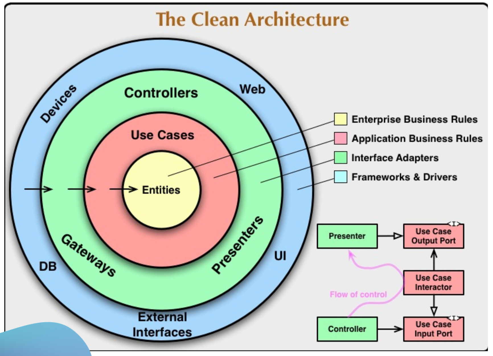

## Basic Principles

** What is Clean Architecture?**

Clean architecture is a software design philosophy that separates the elements of a design into ring levels.
An important goal of clean architecture is to provide developers with a way to organize code in such a way that it encapsulates the business logic but keeps it separate from the delivery mechanism.

Clean architecture was created by Robert C. Martin and promoted on his blog, Uncle Bob.
Like other software design philosophies, clean architecture attempts to provide a cost-effective methodology that makes it easier to develop quality code that will perform better, is easier to change and has fewer dependencies.

 

## Video

** You can watch our video for a brief intro about Clean Architecture at Hackney Council: **

<figure class="video-container">
  <iframe width="100%" src="https://www.youtube.com/embed/zhGG9jt4iBE" title="YouTube video player" frameborder="0" allow="accelerometer; autoplay; clipboard-write; encrypted-media; gyroscope; picture-in-picture" allowfullscreen></iframe>
</figure>

## Base API Folder Structure

We have 2 project folders:
1. The actual project implementation
2. The Test Folder - which will mirror the implementation

If we look at our implementation Folder, we will notice that our code is structured into various code files and these files are all categorised, containing different subfolders.

### Type of Folders

 ** Behavioural Folders: **        

 - Controller
 - Gateway
 - UseCase

** Data Structure Folders: **
- Boundary
- Domain
- Factories
- Infrastructure


```shell title="Folder Structure" {6,12,16}
.
├── example-api
│   ├── V1
│   │   ├── Boundary
│   │   │   └── ..
│   │   ├── Controllers
│   │   │   └── ..
│   │   ├── Domain
│   │   │   └── ..
│   │   ├── Factories
│   │   │   └── ..
│   │   ├── Gateways
│   │   │   └── ..
│   │   ├── Infrastructure
│   │   │   └── ..
│   │   └── UseCase
│   │       └── ..
│   └── ..
├── example-api.Tests
│   └── ..
└── ..
```
* _The three highlighted lines above are the **behavioural** folders_

### Explore Our Folders

1. **Boundary**
  * This folder will hold all of the structures of data that we will expect to get in return to the calling client
  * We use this folder to GET a Request or SEND a Response Make sure the way you structure the object response is clear and easy to understand

2. ** Controller **
  * In this folder we set up the End Points for our APIs

3. ** Domain **
  * This folder is used to manipulate data
  * In here we do any calculations within our app

4. ** Factories **
  * In here we do our conversion from one type of data structure to the next one (e.g: convert a domain object to a response one)

5. ** Gateway **
  * The responsability of the Gateway is to handle the interaction between your API and any external dependancies (such as another API or a Database)
  * Gateway also has to be able to manipulate data in some way

6. ** Infrastructure **
  * In this folder, we set up the data structures that our Gateway will use

7. ** The UseCase **
  * This is where we handle all of the behaviour/logic in our application.

## Request Workflow


_A simplified diagram of how we process requests in our APIs_

## Good to Know

** Generally, in Gateway and Use Cases, we tend to have Interface Folders. **

** Reasons: **
- When your API interacting with Boundaries, we don't interact with classes directly, but with the Interfaces
- It makes the app more **testable**
- It allows us to do **dependancy injection** (we can set up an interface and this gets injected in the app whenever it's needed)

** MUST HAVE: **

- The Interface Folder defines the contract for your implementation
- Any class that implements an Interface MUST have the 'Execute' method, otherwise your program won't compile properly
