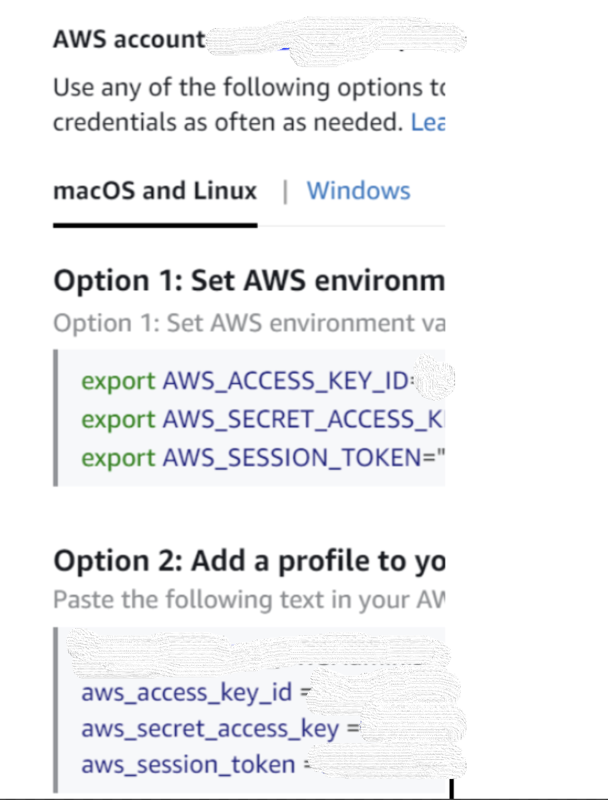

import TextToSpeech from '../src/SpeechComponent.js';

<TextToSpeech>

## Steps to connect to EC2 instances in a private subnet:

** Prerequisites **

1. Ensure you have installed AWS CLI v2;

2. Ensure you have installed AWS Session manager plugin;
## If using AWS IAM user credentials:

Run the following command to configure your AWS credentials:
### AWS configure:

** When prompted, provide the credentials required: **

1. Access key: your access key;

2. Secret access key:  your secret key;

3. Region: eu-west-2;

4. Output format: json;
## If using credentials from AWS SSO:

 If you already have an AWS account and you use AWS SSO:

1. Go to the SSO portal and navigate to the account in which the EC2 instance is hosted;


2. Click on ‘Command line or programmatic access’;



3. Copy your credentials (AWS Option 2 in screenshot above) and paste them in your aws credentials file (Usually located at the following path: Users -> your username -> .aws -> credentials);

4. Alternatively(AWS Option 1 in screenshot above), copy the EXPORT commands to set up the credentials locally in your CLI;


Once the above is completed, please run the following command, where INSTANCE-ID is the EC2 instance ID as it appears in AWS console:

```powershell
aws ssm start-session --target INSTANCE-ID --document-name
AWS-StartPortForwarding Session --[REDACTED]
"localPortNumber=[REDACTED],portNumber=[REDACTED]"
```
```powershell
Starting session with SessionId: xpress-db-server-remote-user-[REDACTED]
Port opened for sessionId xpress-db-server-remote-user-[REDACTED]
Connection accepted for session xpress-db-server-remote-user-[REDACTED]
```

The above command will start a port forwarding session. To connect to your EC2 instance, go to your Remote Desktop software that you usually use and use `localhost:55678` as the computer name.

You will then be prompted to enter your Windows machine credentials.

</TextToSpeech>