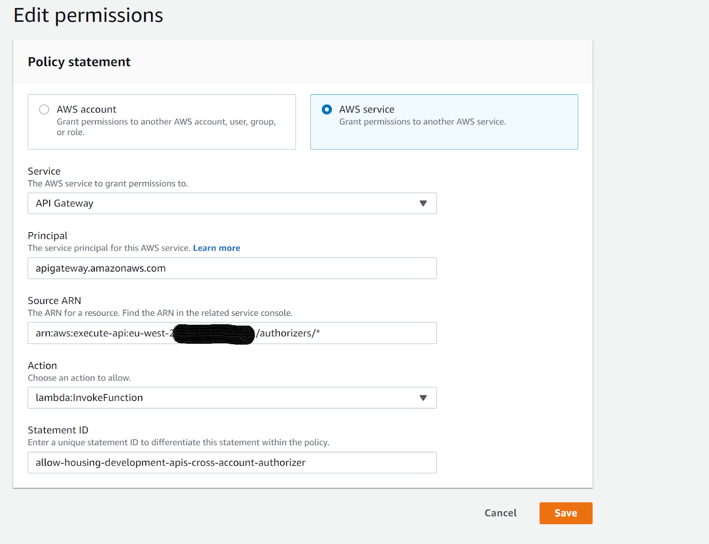
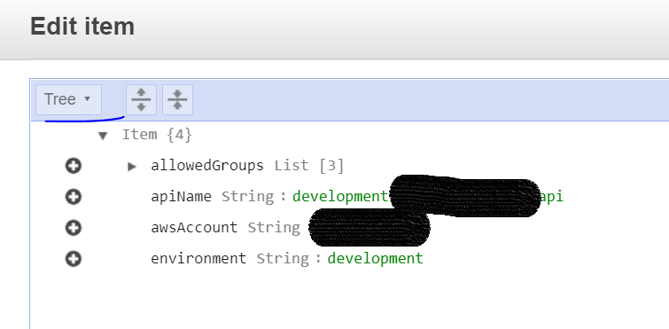
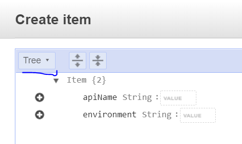

import TextToSpeech from '../src/SpeechComponent.js';

<TextToSpeech>

## What is the API authenticator?

- Centralized API authentication in a single Lambda function
- Deployed only once per environment and used as a cross-account Lambda authorizer for multiple APIs
- Authentication is on API level and is based on Google groups
- Mapping is saved in a DynamoDB table
- Existing Hackney Google tokens are to be used as input for the authenticator
    The API authenticator Lambda decodes the token and uses the data from it to establish if the user belongs to a Google groups that should have access to the specific API in the given environment

### How to set up the API authenticator for your API?
- Locate your API and choose Authorizers.
- Choose Create New Authorizer.
- For Create Authorizer, type an authorizer name in the Name input field.
- For Type, choose the Lambda option.
- For Lambda Function, copy-paste the full ARN for the Lambda authorizer function that we have in our AWS accounts (for each environment you can find the corresponding AWS account above).
- Use the following options:
    Caching - disabled
    Lambda Event Payload - Request
    For Identity Sources use ‘Authorization’ header name


- Click on Create
- Set up your API to be using the authorizer 

The API authenticator needs to assume a role in order to communicate with the API Gateway API and retrieve the name of your API based on API ID (which is part of the request payload). Ensure your account already has the following role created:

LBH_Api_Gateway_Allow_GET

If the role does not exist, create a new IAM role with the above name (very important!) and the following policy:
```json
{
    "Version": "2012-10-17",
    "Statement": [
        {
            "Sid": "VisualEditor0",
            "Effect": "Allow",
            "Action": "apigateway:GET",
            "Resource": "*"
        }
    ]
}
```

**Important**: Make sure you add the account where the API authenticator is hosted (the AWS APIs accounts based on environment) as a trusted entity to the IAM role.

### How to set up the API authenticator if your API is in a different AWS account?
If the API that will use the API authenticator is in a different account, the following actions need to be taken:
- Create (if it doesn’t already exist) the IAM role called ‘LBH_Api_Gateway_Allow_GET’ described in the previous section. 
- Go to the Lambda function of the API authenticator in the respective API AWS account
- Go to the ‘Permissions’ tab and check if there is ‘Resource-based policy’ for the account in which your API is hosted
If there isn’t, create one like the example below:


- Where the source ARN is in the following format: arn:aws:execute-api:eu-west-2:[ACCOUNT ID]:*/authorizers/*

### How to add to amend which Google groups are allowed for a given API?
There is a DynamoDB table in DevelopmentAPIs, StagingAPIs and ProductionAPIs AWS accounts.

Table name: APIAuthenticatorData

To allow a certain Google group to access an API:
- Find the entry for your API and amend the ‘allowedGroups’ property
- If an entry doesn’t exist, create one
- Amend access to an API that is already set up 
- Go to the respective API account, where the API authenticator is deployed
- Go to DynamoDB
- Open the  ‘APIAuthenticatorData’ table and locate the record you wish to amend
- Click on the record to edit and switch to ‘Text’ view

- Amend the ‘allowedGroups’ list by adding/removing the name of the Google group

### Add a new API record
If you have set up a new API, you will need to add a new record to the ‘APIAuthenticatorData’ table in order to allow access.

- Go to the respective API account, where the API authenticator is deployed
- Go to DynamoDB
- Click on ‘Create item’
- Select ‘Text’ view

- Add a new record in the following format (amend values as required)
```json
{
  "allowedGroups": [
    "testing-development"
  ],
  "apiName": "development-test-api", 
  "awsAccount": "1234567890",  //account number where your API is deployed
  "environment": "development"
}
```

**NB**
The ‘apiName’ value should be the API name as it appears in API gateway


</TextToSpeech>