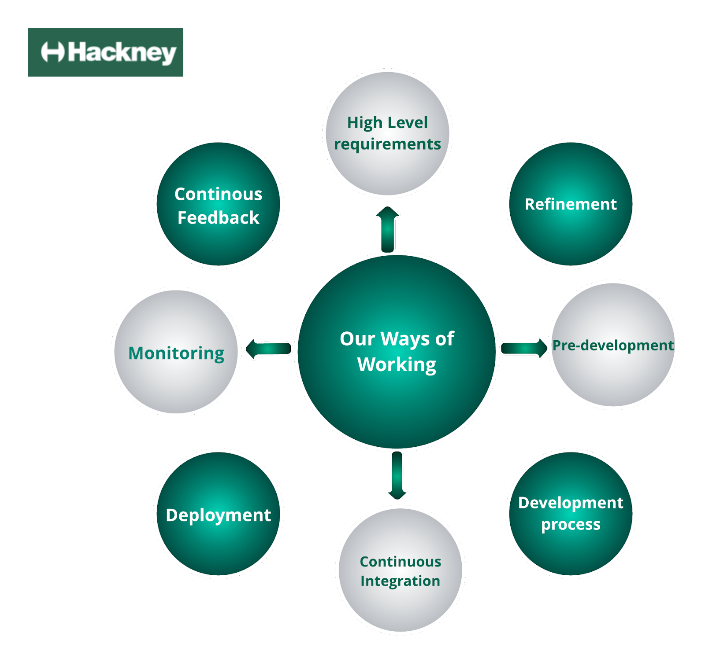

import TextToSpeech from '../src/SpeechComponent.js';

<TextToSpeech>
**Tech Ways of Working **

** Deploying to Production **

**Deployment Pipeline**

A Deployment pipeline is the process of taking code from a version control repo, such as Github, and releasing a version or the master branch to our deployment environments in an automated fashion. 

We use CI/CD in Hackney as an efficient way to build, test and deploy new code.  \
CI/CD is short for Continuous Integration and Continuous Delivery/Deployment.

CI/CD works in conjunction with the following processes:
* Version control (branches, commits, merges)
* Build automation/continuous integration
* Test automation
* Deploy automation

We use a combination of software functions in Github and Circle CI, configured via a Yaml file to fully automate environment deployments. 

Our deployments usually support the following environments: 
*  Development
*  Staging
* Production 

_At Hackney, we use multiple environments to improve our development workflow.Using multiple environments ensures that our software is rigorously tested before it is deployed and made available to users. Having a well-tuned workflow not only keeps our team productive, but it also helps our developers to deliver software that is reliable and in a timely manner._

* **_Development: The development environment would be the first line of defense against bugs. Here, developers deploy their code and test any newly implemented features_**
* **_Staging: Once developers are satisfied with their code and consider it fairly stable, it is then deployed to the staging environment for further testing. This is where Quality Assurance (QA) is performed.Any bugs or enhancements are reported back by testers and the process is repeated until the code passes the staging phase._**
* **_Production: Once the code has been thoroughly tested, it is then pushed to production where it is made available to end-users._**

The CI/CD yaml configuration is stored in a file in a specifically named folder. The yaml configuration contains all the steps which will be carried out in CircleCI as part of the deployment. 

Before any changes are made to an API it is critical to ensure that swagger documentation and API Specifications are completed. Once both of the documents are completed then they can be reviewed by Hackney Developers during a Data meetup. Data meetup is for developers to discuss any new changes that have been made to any of the APIs so that developers can gain a better understanding of the changes that are going to be made in the future. This session is very key as changes to an API can affect other projects and services hence developers need to be aware. 

**Our Deployment Process**

The deployment process is initiated via a commit to a working branch in Github. All branch commits are built and code tests are run. Branches with failing tests or builds cannot be merged into the master branch which is used for deployments.

Before a branch can be merged into master, after a successful build and test, it is marked for code review via a PR (Pull Request) in Github. An approved PR will then fully initiate the CI/CD pipeline process.

_At Hackney, we follow a simple but efficient process of having each individual Pull request reviewed by Senior Developers and other members of the team before merging it into the working project’s base branch. The reviewer will ensure that the code written can benefit the project and best practices are being followed accordingly. When giving feedback on an error in a pull request, our Seniors always adopt a constructive mindset and try to use positive language. _

_One of the best practices encouraged at Hackney Council is Continuous Integration (CI). Continuous integration by itself encourages developers to commit code more often, it makes it easier to detect errors when they open a PR, and reduces the amount of code that needs to be  debugged if something goes wrong. Frequent code updates also make it effortless to merge changes made in a pull request, so all developers can spend more time writing code instead of resolving potential branch conflicts._

The steps for a deployment are usually the following: 

*  Code formatting check
*  Code build and test
* Deployment software tools installation
* Assignment of necessary security roles for deployments to AWS Lambda

The successful completion of all of these steps will allow automated code deployment to the development environments. 

**Deploying to Staging and Production**

In order to deploy to Staging and Production environments, manual approval in CircleCI is required as the final step.

The automation of the deployment to different environments gives flexibility in making small changes to the code and testing of features before deployment to a production environment.

Deployment Automation means we decrease the possibility of human error when releasing new versions of code to deployment environments.

Always follow the **least privilege** principle - only pipeline machine users have elevated permissions to deploy code and create cloud resources in our AWS accounts. 

**Hackney Development Standards - 12 Factors APP **

The Twelve-Factor App Methodology is suggested by developers for smoothly working and delivering Software as a Service (SaaS) Applications or Web Apps with a focus on Microservices.

More information about Hackney Council’s Development standards can be found on the link below: 

    [https://playbook.hackney.gov.uk/ways-of-working/](https://playbook.hackney.gov.uk/ways-of-working/)

As part of our Organisation's ways of working and managing APIs, we encourage developers that every time an API is deployed to production to publish the Swagger definition accordingly. 

**Continuous Monitoring **

* Alarms (notify by email) _using AWS CloudWatch alarms based on various metrics_
* Canaries for availability monitoring _using AWS CloudWatch Synthetics_
* Collecting Feedback _via feedback forms accessible to our users_
* Dashboards _using AWS CloudWatch for easy visualisation of issues_
* Notifications by email if secrets are exposed, pipelines cancel deployment if errors occur.
    * AWS scans our repositories
    * GitGuardian scanning

**Continuous Feedback**

We are always looking at ways we can improve. If you have any ideas or suggestions please share your feedback on our playbook [GitHub Repo](https://github.com/LBHackney-IT/API-Playbook).

</TextToSpeech>