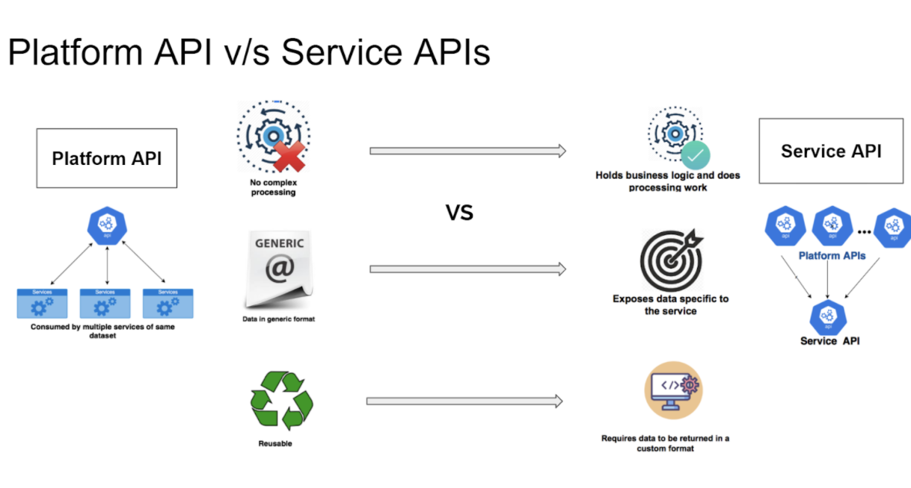

** A Service APIs used for specific data representation. **

** Service APIs have additional data processing to satisfy a specific service need. **

** <u> Criteria: </u> **

1. Consumes 1 or more platform APIs and customize the JSON to their needs.

** Platform APIs is to provide all available data for a given domain (i.e. transactions) in a generic format. **

** Service APIs should consume the platform API and modify the response object to meet their specific needs (if required). **

2. Holds business logic and does processing work on data to meet the specific needs of a service.
  a. Service APIs are to consume platform APIs to retrieve data from different domains. The service APIs can then process and modify the data in any way required to satisfy the given service requirement.

3. Requires data to be returned in a custom format, different from the one exposed by platform APIs.
  a. A service API should only be created if it returns data (or does data processing) different from the one returned by a platform API to avoid duplication. (i.e. No service API endpoint should be created to return rent transactions UNLESS business logic is required to be applied to change the response object returned by the platform Transactions API)

4. Exposes data specific to the service (e.g. Interactions data for Manage a tenancy) - data not read or produced by any other service.

5. We should only connect to a data source directly if reading or writing data that is not part of our data domain.
